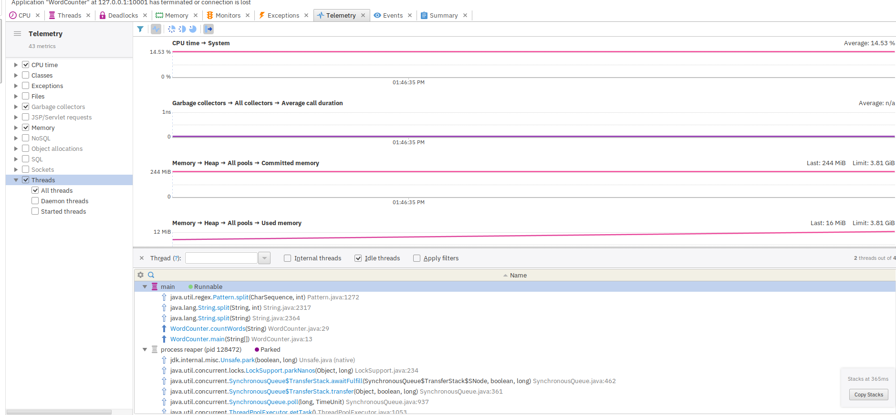
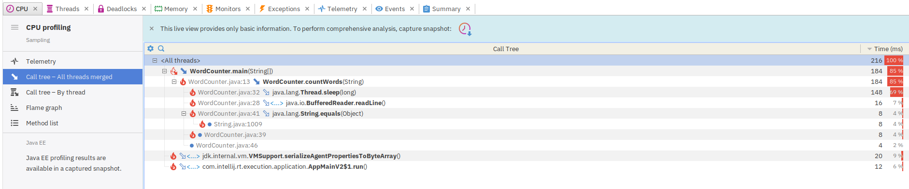
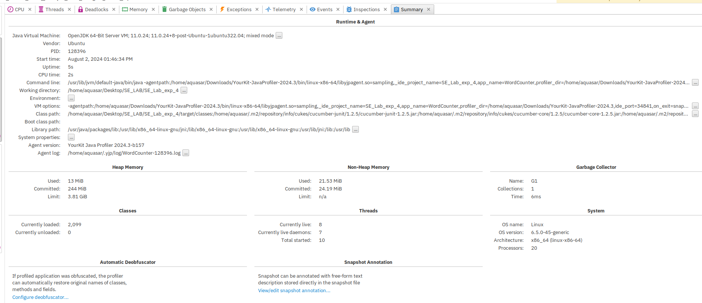
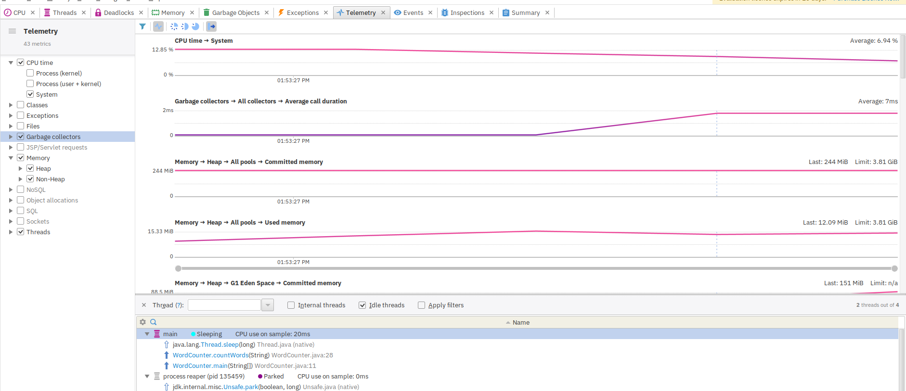
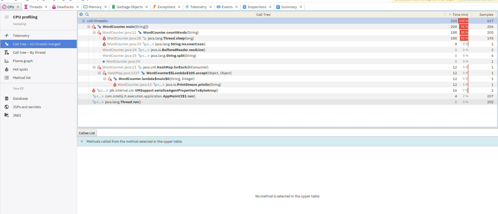
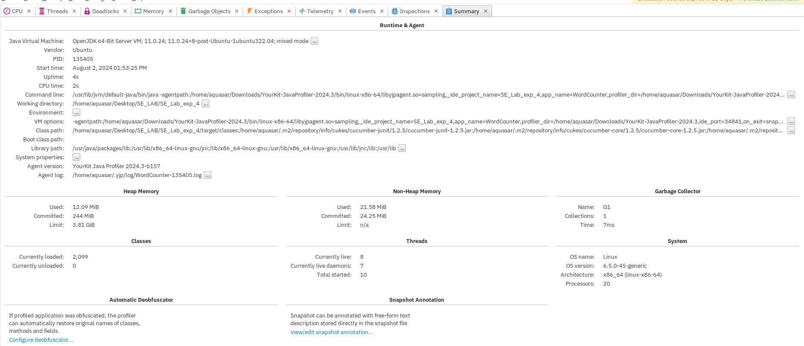

# SE_Lab_exp_4
# آزمایشگاه مهندسی نرم‌افزار - آزمایش چهارم 
اعضای گروه:
امیرحسین حاجی محمد رضایی - ۹۹۱۰۹۲۵۲
علی رازقندی - ۹۹۱۰۹۲۹۶
سید‌رضا قمقام - ۹۹۱۷۰۵۴۲

# BDD

بخش اول)

ابتدا پروژه را ایجاد میکنیم


سپس dependancyهای مورد نیاز را اضافه میکنیم:


و اجرای تست maven:


که بدون ارور انجام میشود:


ملزومات پروژه با موفقیت راه اندازی میشود


افزودن پکیج resources


سپس پیکر بندی پروژه را انجام میدهیم:


حال خطوط کد را وارد میکنیم:


ترجمه و افزودن به mystepdef 


ساخت کلاس calculator


مجددا maven test را با موفقیت اجرا میکنیم:


همانطور که مشاهده میکنیم تست های cxalculator.feature با موفقیت پاس شدند:


افزودن کلاس RunnerTest:


اجرای RunnerTest:


بخش دوم)

 scenario outline را اضافه میکنیم:


این بار با اجرای RunnerTest به ارور بر میخوریم:


که علت آن عدد منفی در examples است.
از آن جایی که regex مربوطه در mystepdef علامت منفی پیش بینی نشده این اشکال بوجود میآید.
برای رفع این خطا باید دو نوع regex دریگر برای حالت هایی که عدد اول یا عدد دوم منفی باشند اضافه کنیم:


حال تمام تست ها با موفقیت پاس میشوند:


بخش سوم)


# Profiling


## Part 2
در ابتدا یک برنامه که تعداد کلمات را در یک فایل متنی شمارش میکند مینویسیم.
```java
import java.io.BufferedReader;
import java.io.FileReader;
import java.io.IOException;
import java.util.ArrayList;
import java.util.List;


public class WordCounter {

    public static void main(String[] args) {
        String filePath = "Profiling/ProfilingTest/src/dummy.txt";
        try {
            List<WordCount> wordCounts = countWords(filePath);
            System.out.println("Word count completed. Unique words: " + wordCounts.size());
            for (WordCount wc : wordCounts) {
                System.out.println(wc.word + ": " + wc.count);
            }
        } catch (IOException e) {
            e.printStackTrace();
        }
    }

    public static List<WordCount> countWords(String filePath) throws IOException {
        List<WordCount> wordCounts = new ArrayList<>();
        BufferedReader reader = new BufferedReader(new FileReader(filePath));
        String line;

        while ((line = reader.readLine()) != null) {
            String[] words = line.split("\\s+");
            try {
                // to sleep 10 seconds
                Thread.sleep(10);
            } catch (InterruptedException e) {
                continue;
            }
            for (String word : words) {
                word = word.toLowerCase();
                boolean found = false;
                for (WordCount wc : wordCounts) {

                    if (wc.word.equals(word)) {
                        wc.count++;
                        found = true;
                        break;
                    }
                }
                if (!found) {
                    wordCounts.add(new WordCount(word, 1));
                }
            }
        }

        reader.close();
        return wordCounts;
    }

    static class WordCount {
        String word;
        int count;

        WordCount(String word, int count) {
            this.word = word;
            this.count = count;
        }
    }
}
```

حال اجرای برنامه را رصد میکنیم.




حال برنامه را در نحوه شمارش بهبود میدهیم.
```java
import java.io.BufferedReader;
import java.io.FileReader;
import java.io.IOException;
import java.util.HashMap;

public class WordCountOptimized {

    public static void main(String[] args) {
        String filePath = "large_text_file.txt";
        try {
            HashMap<String, Integer> wordCounts = countWords(filePath);
            System.out.println("Word count completed. Unique words: " + wordCounts.size());
            wordCounts.forEach((word, count) -> System.out.println(word + ": " + count));
        } catch (IOException e) {
            e.printStackTrace();
        }
    }

    public static HashMap<String, Integer> countWords(String filePath) throws IOException {
        HashMap<String, Integer> wordCounts = new HashMap<>();
        BufferedReader reader = new BufferedReader(new FileReader(filePath));
        String line;

        while ((line = reader.readLine()) != null) {
            String[] words = line.split("\\s+");
            try {
                // to sleep 10 seconds
                Thread.sleep(10);
            } catch (InterruptedException e) {
                continue;
            }
            for (String word : words) {
                word = word.toLowerCase();
                wordCounts.merge(word, 1, Integer::sum);
            }
        }

        reader.close();
        return wordCounts;
    }
}
```

حال برنامه بهینه شده را رصد میکنیم.





در کد بهینه بجای استفاده از لیست از هش مپ استفاده کردیم و همانطور که در عکس های سوم هر پروفایلینگ مشخص است مدت زمان اجرا ۱ ثانیه بهبود داشته است و همچنین مقدار استفاده از حافظه ۱ مگ بایت کمتر شده است.