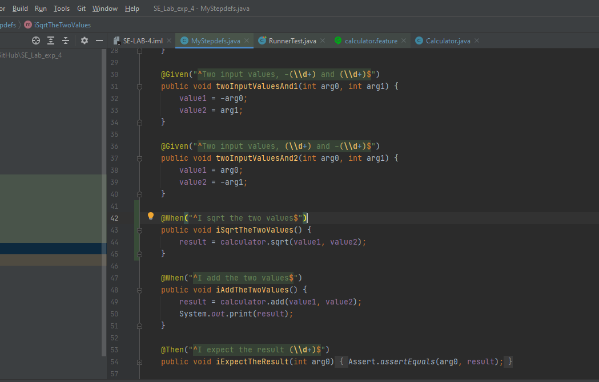
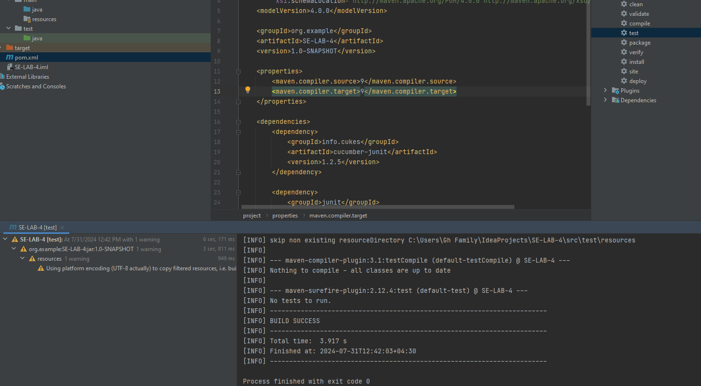

# SE_Lab_exp_4

بخش اول)

ابتدا پروژه را ایجاد میکنیم

سپس dependancyهای مورد نیاز را اضافه میکنیم:

و اجرای تست maven:

که بدون ارور انجام میشود:

ملزومات پروژه با موفقیت راه اندازی میشود

افزودن پکیج resources

سپس پیکر بندی پروژه را انجام میدهیم:

حال خطوط کد را وارد میکنیم:

ترجمه و افزودن به mystepdef 

ساخت کلاس calculator

مجددا maven test را با موفقیت اجرا میکنیم:

همانطور که مشاهده میکنیم تست های cxalculator.feature با موفقیت پاس شدند:

افزودن کلاس RunnerTest:

اجرای RunnerTest:

حال scenario outline را اضافه میکنیم:

این بار با اجرای RunnerTest به ارور بر میخوریم:

که علت آن عدد منفی در examples است.
از آن جایی که regex مربوطه در mystepdef علامت منفی پیش بینی نشده این اشکال بوجود میآید.
برای رفع این خطا باید دو نوع regex دریگر برای حالت هایی که عدد اول یا عدد دوم منفی باشند اضافه کنیم:

حال تمام تست ها با موفقیت پاس میشوند:

بخش دوم)
